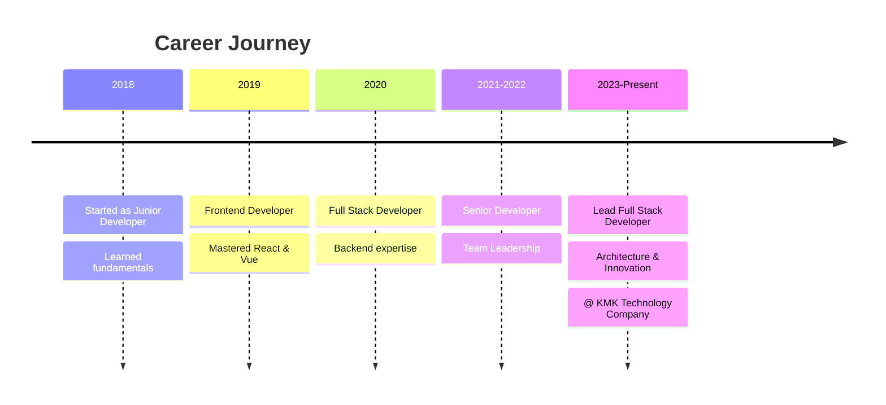

<div align="center">
  
</div>

<div align="center">
  
  [](https://votruong.info)
  [](https://votruong.info)
  [](https://www.linkedin.com/in/v%C3%B5-tr%C6%B0%E1%BB%9Dng-3432882a0/)
  
  
  
</div>

<br/>

## 🎯 About Me

```typescript
const truong: Developer = {
  name: "Võ Trường (Truong Vo)",
  location: "Vietnam 🇻🇳",
  role: "Full Stack Developer",
  company: "KMK Technology Company",
  experience: "6+ years",
  
  specialties: [
    "Enterprise Software Development",
    "High-Performance Web Applications",
    "UI/UX Design & Implementation",
    "System Architecture",
    "Business Process Automation"
  ],
  
  currentFocus: [
    "Advanced Animations & Micro-interactions",
    "Cloud Architecture & Scalability",
    "AI Integration & Automation",
    "Real-time Collaborative Systems"
  ],
  
  philosophy: "Transforming complex problems into elegant solutions",
  motto: "Code with purpose, design with empathy"
};
```

<br/>

## 🛠️ Technology Arsenal

### 🎨 Frontend Development

<div align="center">

#### Core Technologies


#### Frameworks & Libraries


#### State Management


#### UI & Styling


#### Animation & Graphics


</div>

### ⚙️ Backend Development

<div align="center">

#### Languages & Runtimes


#### Frameworks


#### API Development


</div>

### 🗄️ Database & Storage

<div align="center">

#### Relational Databases


#### NoSQL Databases


#### ORMs & Query Builders


</div>

### ☁️ Cloud & DevOps

<div align="center">

#### Cloud Platforms


#### Containerization & Orchestration


#### CI/CD & Automation


#### Monitoring & Analytics


</div>

### 🧪 Testing & Quality Assurance

<div align="center">


</div>

### 🏢 Enterprise & Business Tools

<div align="center">

#### Microsoft Power Platform


#### Project Management & Collaboration


</div>

### 🔧 Development Tools

<div align="center">


</div>

<br/>

## 💼 Professional Experience

<div align="center">



</div>

### Key Achievements

🏆 **200+ Projects Delivered** - Successfully completed diverse web applications  
🚀 **Performance Optimization Expert** - Improved app performance by 60% on average  
👥 **Team Mentor** - Trained and mentored 15+ junior developers  
🎯 **High Client Satisfaction** - Maintained 98% client satisfaction rate  
💡 **Innovation Leader** - Introduced cutting-edge technologies and best practices  

<br/>

## 🌟 Featured Projects & Contributions

<div align="center">

| Project | Description | Tech Stack |
|---------|-------------|------------|
| 🌐 **Enterprise CRM System** | Complete customer relationship management platform | React, Node.js, PostgreSQL, Redis |
| 📊 **Real-time Analytics Dashboard** | High-performance data visualization tool | Next.js, D3.js, WebSocket, MongoDB |
| 🎨 **Interactive Portfolio Platform** | Animated portfolio builder with drag-and-drop | React, GSAP, Three.js, Supabase |
| 🤖 **Business Automation Suite** | Workflow automation using Power Platform | Power Automate, SharePoint, Azure |
| 🛒 **E-commerce Platform** | Scalable multi-vendor marketplace | Next.js, NestJS, PostgreSQL, Stripe |

</div>

<br/>

## 🌍 Community Contributions

<div align="center">

### Active in Vietnamese Developer Communities

| Platform | Role | Focus |
|----------|------|-------|
| 🔗 **TopCode.vn** | Content Creator & Moderator | Code tutorials & best practices |
| 🔗 **ShareCode.vn** | Active Contributor | Open-source code sharing |
| 🔗 **HoTroDoAn.vn** | Technical Advisor | Student project mentoring |

**Impact**: Helped 1000+ developers improve their skills through tutorials and mentorship

</div>

<br/>

## 📊 GitHub Analytics

<div align="center">
  
  
  
  
</div>

<div align="center">
  
  
  
  
</div>

<div align="center">
  
  
  
</div>

<br/>

## 📈 Contribution Graph

<div align="center">
  
  
  
</div>

<br/>

## 🌐 Languages & Communication

<div align="center">

| Language | Proficiency | Usage |
|----------|-------------|-------|
| 🇻🇳 **Vietnamese** | Native | Daily communication & documentation |
| 🇬🇧 **English** | Professional (C1) | Technical docs, international projects |
| 💻 **Code** | Fluent | 20+ programming languages |

</div>

<br/>

## 📫 Let's Connect!

<div align="center">
  
  [](https://www.facebook.com/vtruong.it/)
  [](https://www.youtube.com/@truongbinnn)
  [](https://www.linkedin.com/in/v%C3%B5-tr%C6%B0%E1%BB%9Dng-3432882a0/)
  [](mailto:truong.vd2000@gmail.com)
  [](https://votruong.info)
  [](https://github.com/truongraph)
  
  <br/>
  
  ### 💬 Open for Opportunities
  
  ```
  🔹 Freelance Projects
  🔹 Technical Consulting
  🔹 Speaking Engagements
  🔹 Open Source Collaboration
  🔹 Mentorship Programs
  ```
  
  **Response Time**: Usually within 24 hours ⚡
  
</div>

<br/>

## 🎯 Current Goals & Future Plans

<div align="center">

```typescript
const goals2026: Goals = {
  learning: [
    "Advanced System Design & Architecture",
    "Machine Learning & AI Integration",
    "Web3 & Blockchain Technologies",
    "Edge Computing & IoT"
  ],
  
  contributing: [
    "More Open Source Projects",
    "Technical Blog & Tutorials",
    "Developer Community Building",
    "Conference Speaking"
  ],
  
  building: [
    "SaaS Products",
    "Developer Tools",
    "Educational Platforms",
    "Innovation Labs"
  ],
  
  impact: "Empower 10,000+ developers through education and tools"
};
```

</div>

<br/>

## 💡 Fun Facts

<div align="center">

🎮 **Gaming Enthusiast** - Strategy games help me think differently  
☕ **Coffee Addict** - Powered by caffeine and clean code  
📚 **Continuous Learner** - Always exploring new technologies  
🎵 **Music Lover** - Coding with lo-fi beats  
🌏 **Tech Blogger** - Sharing knowledge with the community  
🏃 **Fitness Advocate** - Healthy body, healthy code  

</div>

<br/>

---

<div align="center">
  
  ### 💭 Quote I Live By
  
  > *"The best way to predict the future is to create it."*  
  > — **Peter Drucker**
  
  <br/>
  
  ### ⚡ Current Status
  
  ```javascript
  while (alive) {
    eat();
    code();
    sleep();
    repeat();
  }
  ```
  
  <br/>
  
  
  
  
  
  <br/>
  
  ### 🤝 Thank You for Visiting!
  
  
  
</div>

<div align="center">
  
</div>
