<div align="center">
  
# 🌟 Xin chào! Tôi là Võ Trường 🌟


<p align="center">
  <a href="https://votruong.info"></a>
  <a href="mailto:truong.vd2000@gmail.com"></a>
  <a href="https://www.linkedin.com/in/v%C3%B5-tr%C6%B0%E1%BB%9Dng-3432882a0/"></a>
</p>


</div>

---

## 🎯 Giới Thiệu Về Tôi

```javascript
const truong = {
    role: "Full Stack Developer",
    company: "KMK Technology Company",
    location: "Ho Chi Minh City, Vietnam 🇻🇳",
    experience: "6+ years",
    code: ["JavaScript", "TypeScript", "PHP", "Python", "C#", "Java", "Go", "Rust"],
    askMeAbout: ["Web Dev", "System Design", "UI/UX", "Automation", "Animation"],
    technologies: {
        frontEnd: {
            js: ["React", "Next.js", "Vue", "Angular", "Svelte", "Nuxt.js"],
            css: ["Tailwind", "Sass", "Styled Components", "Material-UI", "Ant Design"],
            animation: ["GSAP", "Framer Motion", "Three.js", "Anime.js", "Lottie"]
        },
        backEnd: {
            js: ["Node.js", "Express", "NestJS", "Fastify", "Koa"],
            php: ["Laravel", "Symfony", "CodeIgniter"],
            csharp: [".NET Core", "ASP.NET", "Entity Framework"],
            python: ["Django", "FastAPI", "Flask"],
            java: ["Spring Boot", "Hibernate"],
            go: ["Gin", "Echo", "Fiber"],
            rust: ["Actix", "Rocket"]
        },
        databases: ["PostgreSQL", "MySQL", "MongoDB", "Redis", "SQL Server", "SQLite", "DynamoDB"],
        mobile: ["React Native", "Flutter", "Ionic"],
        devOps: ["Docker", "Kubernetes", "GitHub Actions", "Jenkins", "GitLab CI/CD"],
        cloud: ["AWS", "Azure", "Google Cloud", "Vercel", "Netlify", "DigitalOcean"],
        tools: ["Git", "VSCode", "Postman", "Figma", "Jira", "Slack"]
    },
    architecture: ["Microservices", "Serverless", "MVC", "MVVM", "Clean Architecture"],
    currentFocus: "Building Scalable Systems & Beautiful User Experiences",
    funFact: "I debug with console.log and I'm proud of it! 😄"
};
```

<div align="center">
  
</div>

---

## 💻 Tech Stack Chi Tiết

<details open>
<summary><b>🎨 Frontend Technologies</b></summary>
<br>

### Core Web Technologies


### Frontend Frameworks & Libraries


### UI Libraries & Styling


### Animation & Graphics


### State Management


</details>

<details open>
<summary><b>⚙️ Backend Technologies</b></summary>
<br>

### JavaScript/TypeScript Runtime & Frameworks


### PHP Frameworks


### .NET Technologies


### Python Frameworks


### Java Ecosystem


### Go & Rust


### Ruby


### GraphQL & API


</details>

<details open>
<summary><b>🗄️ Databases & Caching</b></summary>
<br>

### Relational Databases


### NoSQL Databases


### ORM & Query Builders


</details>

<details open>
<summary><b>📱 Mobile & Cross-Platform</b></summary>
<br>


</details>

<details open>
<summary><b>☁️ Cloud & DevOps</b></summary>
<br>

### Cloud Platforms


### Containerization & Orchestration


### CI/CD


### Monitoring & Logging


</details>

<details open>
<summary><b>🏢 Microsoft Power Platform & Enterprise</b></summary>
<br>


</details>

<details open>
<summary><b>🛠️ Development Tools</b></summary>
<br>


</details>

<details open>
<summary><b>🔧 Testing & Quality</b></summary>
<br>


</details>

---

## 📊 GitHub Analytics

<div align="center">
  
  
</div>

<div align="center">
  
</div>

<div align="center">
  
</div>

<div align="center">
  
</div>

---

## 🏆 Achievements & Highlights

```mermaid
graph LR
    A[6+ Years Experience] --> B[Full Stack Expert]
    B --> C[50+ Projects]
    C --> D[Enterprise Solutions]
    D --> E[Clean Code Advocate]
    E --> F[Continuous Learner]
    
    style A fill:#00D9FF,stroke:#00D9FF,color:#000
    style B fill:#00D9FF,stroke:#00D9FF,color:#000
    style C fill:#00D9FF,stroke:#00D9FF,color:#000
    style D fill:#00D9FF,stroke:#00D9FF,color:#000
    style E fill:#00D9FF,stroke:#00D9FF,color:#000
    style F fill:#00D9FF,stroke:#00D9FF,color:#000
```

<div align="center">



</div>

### 💼 Professional Milestones

<table>
<tr>
<td align="center" width="33%">
  
  <br><strong>50+ Projects</strong>
  <br>Successfully delivered
</td>
<td align="center" width="33%">
  
  <br><strong>High Performance</strong>
  <br>Optimized applications
</td>
<td align="center" width="33%">
  
  <br><strong>Team Leadership</strong>
  <br>Mentored developers
</td>
</tr>
</table>

---

## 🌍 Open Source Contributions

<div align="center">

| Project | Description | Tech Stack |
|---------|-------------|------------|
| 🔗 **[TopCode.vn](https://topcode.vn)** | Vietnamese coding community platform | React, Node.js, MongoDB |
| 🔗 **[ShareCode.vn](https://sharecode.vn)** | Code sharing and collaboration | Vue.js, Laravel, MySQL |
| 🔗 **[HoTroDoAn.vn](https://hotrodoann.vn)** | Student project support platform | Next.js, Prisma, PostgreSQL |

</div>

---

## 📚 Latest Blog Posts & Projects

<div align="center">

<!-- BLOG-POST-LIST:START -->
- 🚀 Building Scalable Microservices with Node.js
- 🎨 Advanced Animation Techniques with GSAP
- 🔐 Implementing JWT Authentication in Next.js
- ⚡ Optimizing React Performance with Lazy Loading
- 🌐 Creating RESTful APIs with Laravel
<!-- BLOG-POST-LIST:END -->

</div>

---

## 🎓 Certifications & Skills

<div align="center">

### 🏅 Core Competencies

<table>
<tr>
<td align="center" width="25%">
  <strong>🎯 Architecture Design</strong>
  <br>Microservices, Serverless
</td>
<td align="center" width="25%">
  <strong>⚡ Performance</strong>
  <br>Optimization, Caching
</td>
<td align="center" width="25%">
  <strong>🔒 Security</strong>
  <br>Authentication, Authorization
</td>
<td align="center" width="25%">
  <strong>📱 Responsive Design</strong>
  <br>Mobile-First, PWA
</td>
</tr>
</table>

</div>

---

## 🌐 Languages & Communication

<div align="center">

| Language | Proficiency | Usage |
|----------|-------------|-------|
| 🇻🇳 **Tiếng Việt** | Native | Professional & Daily |
| 🇬🇧 **English** | Professional | Technical Documentation & Communication |
| 🇯🇵 **日本語** | Basic | Reading Technical Docs |

</div>

---

## 📬 Let's Connect!

<div align="center">

### 💬 Always Open to Collaboration

<p>
  <a href="https://www.facebook.com/vtruong.it/"></a>
  <a href="https://www.linkedin.com/in/v%C3%B5-tr%C6%B0%E1%BB%9Dng-3432882a0/"></a>
  <a href="https://www.youtube.com/@truongbinnn"></a>
  <a href="mailto:truong.vd2000@gmail.com"></a>
  <a href="https://votruong.info"></a>
</p>


<p align="center">
  
</p>

---

<p align="center">
  <i>"Code is like humor. When you have to explain it, it's bad." - Cory House</i>
</p>

<p align="center">
  
</p>

</div>
