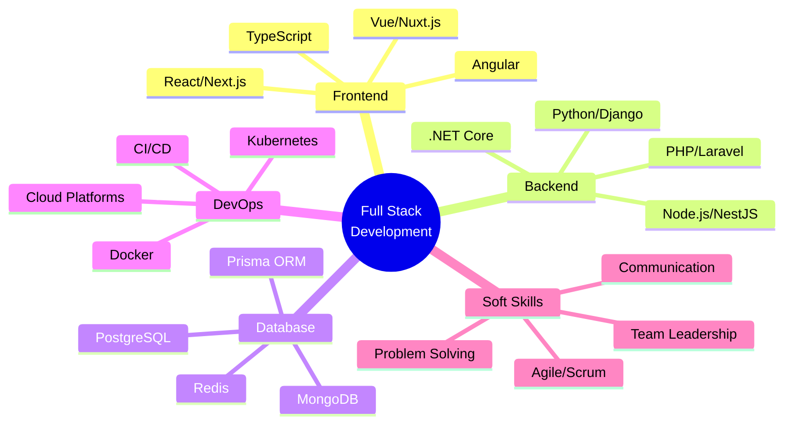

<div align="center">
  
</div>

<div align="center">
  
  [](https://git.io/typing-svg)
  
  <br/>
  
  <a href="https://votruong.info" target="_blank">
    
  </a>
  <a href="mailto:truong.vd2000@gmail.com">
    
  </a>
  <a href="https://www.linkedin.com/in/v%C3%B5-tr%C6%B0%E1%BB%9Dng-3432882a0/" target="_blank">
    
  </a>
  
  <br/><br/>
  
  
  
</div>

<br/>


## 🎯 About Me

```typescript
const truong = {
    name: "Võ Trường",
    location: "Ho Chi Minh City, Vietnam 🇻🇳",
    role: "Full Stack Developer",
    company: "KMK Technology Company",
    experience: "6+ years",
    
    currentFocus: [
        "Advanced Animations & Interactions",
        "Microservices Architecture",
        "Business Process Automation",
        "AI/ML Integration",
        "Performance Optimization"
    ],
    
    interests: [
        "Clean Code Architecture",
        "UI/UX Design Systems",
        "Cloud Native Applications",
        "Open Source Contribution"
    ],
    
    motto: "Transforming ideas into elegant solutions ✨"
};
```

<br clear="right"/>

## 🛠️ Technology Arsenal

<div align="center">

### 🎨 Frontend Development

<table>
<tr>
<td align="center" width="96">

<br>HTML5
</td>
<td align="center" width="96">

<br>CSS3
</td>
<td align="center" width="96">

<br>JavaScript
</td>
<td align="center" width="96">

<br>TypeScript
</td>
<td align="center" width="96">

<br>React
</td>
<td align="center" width="96">

<br>Next.js
</td>
<td align="center" width="96">

<br>Vue.js
</td>
<td align="center" width="96">

<br>Nuxt.js
</td>
</tr>
<tr>
<td align="center" width="96">

<br>Angular
</td>
<td align="center" width="96">

<br>Svelte
</td>
<td align="center" width="96">

<br>Redux
</td>
<td align="center" width="96">

<br>Vite
</td>
<td align="center" width="96">

<br>Webpack
</td>
<td align="center" width="96">

<br>Three.js
</td>
<td align="center" width="96">

<br>GraphQL
</td>
<td align="center" width="96">

<br>jQuery
</td>
</tr>
</table>

### 🎨 Styling & UI Frameworks

<table>
<tr>
<td align="center" width="96">

<br>Tailwind
</td>
<td align="center" width="96">

<br>Sass
</td>
<td align="center" width="96">

<br>Bootstrap
</td>
<td align="center" width="96">

<br>Material UI
</td>
<td align="center" width="96">

<br>Ant Design
</td>
<td align="center" width="96">

<br>Chakra UI
</td>
<td align="center" width="96">

<br>Framer
</td>
<td align="center" width="96">

<br>GSAP
</td>
</tr>
</table>

### ⚡ Backend Development

<table>
<tr>
<td align="center" width="96">

<br>Node.js
</td>
<td align="center" width="96">

<br>Express
</td>
<td align="center" width="96">

<br>NestJS
</td>
<td align="center" width="96">

<br>PHP
</td>
<td align="center" width="96">

<br>Laravel
</td>
<td align="center" width="96">

<br>Symfony
</td>
<td align="center" width="96">

<br>.NET Core
</td>
<td align="center" width="96">

<br>C#
</td>
</tr>
<tr>
<td align="center" width="96">

<br>Python
</td>
<td align="center" width="96">

<br>Django
</td>
<td align="center" width="96">

<br>Flask
</td>
<td align="center" width="96">

<br>FastAPI
</td>
<td align="center" width="96">

<br>Java
</td>
<td align="center" width="96">

<br>Spring
</td>
<td align="center" width="96">

<br>Go
</td>
<td align="center" width="96">

<br>Ruby
</td>
</tr>
</table>

### 🗄️ Database & ORM

<table>
<tr>
<td align="center" width="96">

<br>PostgreSQL
</td>
<td align="center" width="96">

<br>MySQL
</td>
<td align="center" width="96">

<br>MongoDB
</td>
<td align="center" width="96">

<br>Redis
</td>
<td align="center" width="96">

<br>SQLite
</td>
<td align="center" width="96">

<br>Prisma
</td>
<td align="center" width="96">

<br>Firebase
</td>
<td align="center" width="96">

<br>Supabase
</td>
</tr>
</table>

### ☁️ Cloud & DevOps

<table>
<tr>
<td align="center" width="96">

<br>Docker
</td>
<td align="center" width="96">

<br>Kubernetes
</td>
<td align="center" width="96">

<br>AWS
</td>
<td align="center" width="96">

<br>Azure
</td>
<td align="center" width="96">

<br>GCP
</td>
<td align="center" width="96">

<br>Vercel
</td>
<td align="center" width="96">

<br>Netlify
</td>
<td align="center" width="96">

<br>Heroku
</td>
</tr>
<tr>
<td align="center" width="96">

<br>Actions
</td>
<td align="center" width="96">

<br>Jenkins
</td>
<td align="center" width="96">

<br>Nginx
</td>
<td align="center" width="96">

<br>Linux
</td>
<td align="center" width="96">

<br>Git
</td>
<td align="center" width="96">

<br>GitHub
</td>
<td align="center" width="96">

<br>GitLab
</td>
<td align="center" width="96">

<br>Terraform
</td>
</tr>
</table>

### 🧪 Testing & Quality

<table>
<tr>
<td align="center" width="96">

<br>Jest
</td>
<td align="center" width="96">

<br>Vitest
</td>
<td align="center" width="96">

<br>Cypress
</td>
<td align="center" width="96">

<br>Testing Lib
</td>
<td align="center" width="96">

<br>Selenium
</td>
<td align="center" width="96">

<br>Playwright
</td>
<td align="center" width="96">

<br>ESLint
</td>
<td align="center" width="96">

<br>Prettier
</td>
</tr>
</table>

### 🏢 Microsoft Power Platform & Enterprise

<table>
<tr>
<td align="center" width="96">

<br>Power BI
</td>
<td align="center" width="96">

<br>Automate
</td>
<td align="center" width="96">

<br>Power Apps
</td>
<td align="center" width="96">

<br>SharePoint
</td>
<td align="center" width="96">

<br>Teams
</td>
<td align="center" width="96">

<br>Excel VBA
</td>
<td align="center" width="96">

<br>M365
</td>
<td align="center" width="96">

<br>Azure AD
</td>
</tr>
</table>

### 🛠️ Tools & IDEs

<table>
<tr>
<td align="center" width="96">

<br>VS Code
</td>
<td align="center" width="96">

<br>VS
</td>
<td align="center" width="96">

<br>IntelliJ
</td>
<td align="center" width="96">

<br>Postman
</td>
<td align="center" width="96">

<br>Figma
</td>
<td align="center" width="96">

<br>Photoshop
</td>
<td align="center" width="96">

<br>Illustrator
</td>
<td align="center" width="96">

<br>Adobe XD
</td>
</tr>
</table>

</div>

<br/>

## 📈 GitHub Analytics

<div align="center">
  
  
</div>

<div align="center">
  
</div>

<div align="center">
  
</div>

<br/>

## 📊 Contribution Graph

<div align="center">
  
[](https://github.com/truongraph)

</div>

<br/>

## 💼 Professional Experience

<details>
<summary><b>🚀 Click to expand my journey</b></summary>

<br/>

**Full Stack Developer** @ KMK Technology Company  
📅 *Current Position*  
- 🎯 Leading development of enterprise-scale applications
- 🏗️ Architecting microservices and distributed systems
- 🎨 Implementing advanced UI/UX with modern frameworks
- 🤖 Integrating AI/ML solutions for business automation
- 📊 Building data visualization and analytics platforms
- 👥 Mentoring junior developers and code reviews

**Previous Highlights:**
- ✨ Built 50+ production-ready web applications
- 🚀 Improved application performance by up to 70%
- 👥 Collaborated with cross-functional teams across multiple projects
- 📱 Developed responsive and accessible interfaces
- 🔧 Implemented CI/CD pipelines and automated testing

</details>

<br/>

## 🌟 Featured Projects

<div align="center">

<a href="https://github.com/truongraph">
  
</a>
<a href="https://github.com/truongraph">
  
</a>

</div>

<br/>

## 🌍 Community & Contributions

<div align="center">

| Platform | Description | Role |
|----------|-------------|------|
| 🔗 **[TopCode.vn](https://topcode.vn)** | Premium coding resources & tutorials | Community Leader |
| 💻 **[ShareCode.vn](https://sharecode.vn)** | Open-source code sharing platform | Core Contributor |
| 🎓 **[HoTroDoAn.vn](https://hotrodoAn.vn)** | Student project support & mentorship | Technical Mentor |

</div>

<br/>

## 🎓 Skills & Expertise

<div align="center">



</div>

<br/>

## 🗣️ Languages

<div align="center">

| Language | Proficiency | Usage |
|----------|-------------|-------|
| 🇻🇳 **Vietnamese** | Native | Daily communication, documentation |
| 🇬🇧 **English** | Professional | Technical docs, international collaboration |
| 🇯🇵 **Japanese** | Basic | Reading technical documentation |

</div>

<br/>

## 📫 Connect With Me

<div align="center">

<a href="https://votruong.info" target="_blank">
  
</a>
<a href="mailto:truong.vd2000@gmail.com">
  
</a>
<a href="https://www.linkedin.com/in/v%C3%B5-tr%C6%B0%E1%BB%9Dng-3432882a0/" target="_blank">
  
</a>
<a href="https://www.facebook.com/vtruong.it/" target="_blank">
  
</a>
<a href="https://www.youtube.com/@truongbinnn" target="_blank">
  
</a>
<a href="https://twitter.com/truongraph" target="_blank">
  
</a>
<a href="https://dev.to/truongraph" target="_blank">
  
</a>

</div>

<br/>

## 💭 Random Dev Quote

<div align="center">


</div>

<br/>

## 🎵 Spotify Playing

<div align="center">

[](https://spotify-github-profile.vercel.app/api/view?uid=31zq7qsydbqxauy52klxjqfxrsoi&redirect=true)

</div>

<br/>

## ☕ Support My Work

<div align="center">

If you find my projects helpful, consider buying me a coffee! ☕

<a href="https://www.buymeacoffee.com/truongvo" target="_blank">
  
</a>

</div>

<br/>

---

<div align="center">
  
### 💡 *"Code is like humor. When you have to explain it, it's bad."* – Cory House

<br/>

### Show some ❤️ by starring some of my repositories!

<br/>


</div>


