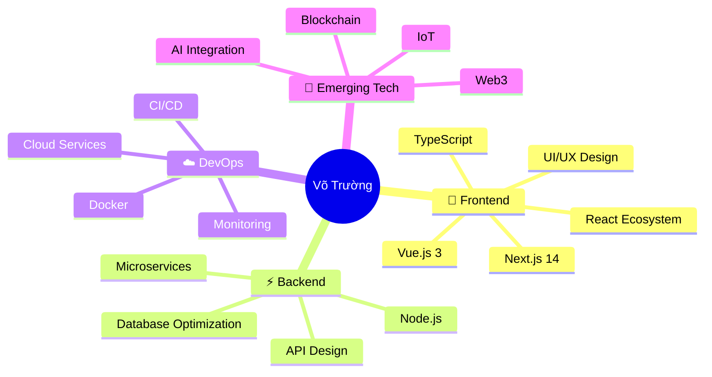

<div align="center">

# 🌟 Welcome to My Digital Universe 🌟


<br/>

```ascii
╔══════════════════════════════════════════════════════════════════╗
║                                                                  ║
║   ██╗   ██╗ ██████╗     ████████╗██████╗ ██╗   ██�� ██████╗ ███╗║
║   ██║   ██║██╔═══██╗    ╚══██╔══╝██╔══██╗██║   ██║██╔═══██╗████║║
║   ██║   ██║██║   ██║       ██║   ██████╔╝██║   ██║██║   ██║██╔█║║
║   ╚██╗ ██╔╝██║   ██║       ██║   ██╔══██╗██║   ██║██║   ██║██║║║
║    ╚████╔╝ ╚██████╔╝       ██║   ██║  ██║╚██████╔╝╚██████╔╝██║║║
║     ╚═══╝   ╚═════╝        ╚═╝   ╚═╝  ╚═╝ ╚═════╝  ╚═════╝ ╚═╝╚║
║                                                                  ║
║              🎯 Crafting Digital Experiences Since 2017          ║
╚══════════════════════════════════════════════════════════════════╝
```

<br/>

[](https://votruong.info)
[](mailto:truong.vd2000@gmail.com)
[](https://www.linkedin.com/in/v%C3%B5-tr%C6%B0%E1%BB%9Dng-3432882a0/)
[](https://www.youtube.com/@truongbinnn)

<br/>


</div>

---

<br/>


## 🎭 About Me

```javascript
class Developer {
  constructor() {
    this.name = "Võ Trường";
    this.role = "Full Stack Developer & Solution Architect";
    this.location = "🇻🇳 Ho Chi Minh City, Vietnam";
    this.company = "KMK Technology Company";
    this.experience = "6+ years";
    this.workingHours = "09:00 - 18:00 GMT+7";
    this.sleepingHours = "Maybe never?  😅";
  }

  getCurrentStatus() {
    return {
      coding: "🔥 In the zone",
      learning: "📚 Always",
      coffee: "☕ Essential fuel",
      music: "🎵 Lofi beats",
      mood: "😎 Ready to build"
    };
  }

  getSkillLevel(skill) {
    const skills = {
      "Problem Solving": "⭐⭐⭐⭐⭐",
      "Code Quality": "⭐⭐⭐⭐⭐",
      "Team Work": "⭐⭐⭐⭐⭐",
      "Coffee Making": "⭐⭐⭐⭐⭐",
      "Debugging":  "⭐⭐⭐⭐⭐"
    };
    return skills[skill] || "Learning... ";
  }

  sayHi() {
    console.log("Thanks for dropping by!  Let's build something amazing together!  🚀");
  }
}

const truong = new Developer();
truong.sayHi();
```

<br clear="right"/>

---

<br/>

## 🎯 Quick Stats

<div align="center">

<table>
<tr>
<td align="center" width="200">

<br/><b>50+</b><br/>Projects Delivered
</td>
<td align="center" width="200">

<br/><b>70%</b><br/>Performance Boost
</td>
<td align="center" width="200">

<br/><b>20+</b><br/>Developers Mentored
</td>
<td align="center" width="200">

<br/><b>∞</b><br/>Cups of Coffee
</td>
</tr>
</table>

</div>

---

<br/>

## 🛠️ Tech Stack

<div align="center">

### 🎨 Frontend Magic


### ⚡ Backend Power


### 🗄️ Database Arsenal


### ☁️ Cloud & DevOps


### 📱 Mobile Development


### 🛠️ Tools & Others


</div>

---

<br/>

## 📊 GitHub Analytics

<div align="center">


</div>

<div align="center">
  
### 🏆 GitHub Trophies


</div>

---

<br/>

## 🎯 Current Focus

<div align="center">


```mermaid
mindmap
  root((Võ Trường))
    🎨 Frontend
      React Ecosystem
      Vue.js 3
      Next.js 14
      TypeScript
      UI/UX Design
    ⚡ Backend
      Node.js
      Microservices
      API Design
      Database Optimization
    ☁️ DevOps
      Docker
      CI/CD
      Cloud Services
      Monitoring
    🤖 Emerging Tech
      AI Integration
      Web3
      Blockchain
      IoT
```

</div>

---

<br/>

## 🚀 Featured Projects

<div align="center">

<table>
<tr>
<td width="50%" valign="top">

### 🌟 E-Commerce Platform
Scalable e-commerce solution with modern tech stack
- ⚡ Next.js + TypeScript
- 🎨 TailwindCSS + Framer Motion  
- 🛍️ Stripe Integration
- 📊 Real-time Analytics

[](https://github.com/truongraph)

</td>
<td width="50%" valign="top">

### 💼 Business Automation Suite
Enterprise workflow automation platform
- 🤖 Power Automate Integration
- 📈 Business Intelligence
- 🔄 Process Orchestration
- 📊 Custom Dashboards

[](https://github.com/truongraph)

</td>
</tr>
<tr>
<td width="50%" valign="top">

### 🎮 Real-time Gaming Platform
Multiplayer gaming experience
- 🕹️ WebSocket Communication
- 🎯 Canvas API Graphics
- 🏆 Leaderboard System
- 💬 Live Chat

[](https://github.com/truongraph)

</td>
<td width="50%" valign="top">

### 📱 Mobile App Suite
Cross-platform mobile applications
- 📲 React Native
- 🔥 Firebase Backend
- 🎨 Beautiful UI/UX
- 📊 Analytics Integration

[](https://github.com/truongraph)

</td>
</tr>
</table>

</div>

---

<br/>

## 💼 Professional Journey

<div align="center">

```ascii
2017 → 2018 → 2020 ───────────────────────→ 2026
  │      │      │                              │
  │      │      │                              │
  🎓     💻     🚀                             ⭐
Start  Junior  Full Stack              Senior Architect
       Dev     Developer
```

</div>

### 🏢 Career Timeline

<details>
<summary><b>🔥 Click to expand my journey</b></summary>

<br/>

**🎯 Senior Full Stack Developer & Solution Architect**  
*KMK Technology Company* | `2020 - Present`

```yaml
Achievements:
  - 🏗️ Led architecture design for 15+ enterprise projects
  - 📈 Improved system performance by 70% on average
  - 👥 Mentored 20+ junior developers
  - 🚀 Deployed 50+ production applications
  - 💡 Implemented CI/CD for entire organization
  - 🏆 "Developer of the Year" Award 2023
```

**💻 Full Stack Developer**  
*Freelance* | `2018 - 2020`

```yaml
Projects:
  - 🌐 30+ client projects worldwide
  - 💼 E-commerce, SaaS, Corporate websites
  - 📱 Mobile apps for iOS & Android
  - 🎨 UI/UX design & prototyping
```

**🎓 Junior Developer**  
*Startup Company* | `2017 - 2018`

```yaml
Learning:
  - 📚 Fundamental web development
  - 🧪 Testing & debugging
  - 👥 Team collaboration
  - 📊 Agile methodologies
```

</details>

---

<br/>

## 🌟 What I Do Best

<div align="center">

<table>
<tr>
<td align="center" width="25%">

<br/><b>Frontend Development</b>
<br/>Creating stunning, responsive UIs
</td>
<td align="center" width="25%">

<br/><b>Backend Architecture</b>
<br/>Building scalable server solutions
</td>
<td align="center" width="25%">

<br/><b>DevOps & Cloud</b>
<br/>Automating deployment pipelines
</td>
<td align="center" width="25%">

<br/><b>Problem Solving</b>
<br/>Turning bugs into features
</td>
</tr>
</table>

</div>

---

<br/>

## 📚 Learning & Growing

<div align="center">

**🎯 Currently Exploring**


**📖 Reading List**

- 📕 Clean Architecture - Robert C. Martin
- 📗 Domain-Driven Design - Eric Evans
- 📘 Designing Data-Intensive Applications
- 📙 System Design Interview - Alex Xu

</div>

---

<br/>

## 🎮 Hobbies & Interests

<div align="center">

| 💻 Coding | ☕ Coffee | 🎵 Music | 📚 Reading | 🎮 Gaming | ✈️ Travel |
|:---------:|:---------:|: --------:|: ----------:|:---------:|:---------:|
| Always | Essential | Lofi Beats | Tech Books | Strategy | When Possible |

</div>

---

<br/>

## 🌐 Community & Contributions

<div align="center">

### 💡 Open Source Contributions


### 🤝 Community Involvement

<table>
<tr>
<td align="center">

<br/><b>10K+ Members</b>
<br/>Community Leader
</td>
<td align="center">

<br/><b>5K+ Projects</b>
<br/>Code Shared
</td>
<td align="center">

<br/><b>500+ Students</b>
<br/>Mentored
</td>
<td align="center">

<br/><b>30+ Articles</b>
<br/>Published
</td>
</tr>
</table>

</div>

---

<br/>

## 📫 Let's Connect! 

<div align="center">

### 💬 Get In Touch

<a href="mailto:truong.vd2000@gmail.com">
  
</a>
<a href="https://www.linkedin.com/in/v%C3%B5-tr%C6%B0%E1%BB%9Dng-3432882a0/">
  
</a>
<a href="https://twitter.com/truongraph">
  
</a>
<a href="https://www.facebook.com/vtruong. it/">
  
</a>
<a href="https://www.youtube.com/@truongbinnn">
  
</a>
<a href="https://dev.to/truongraph">
  
</a>

<br/><br/>

### 💼 Portfolio & Website

[](https://votruong.info)

</div>

---

<br/>

## 💭 Quote of the Day

<div align="center">


</div>

---

<br/>

## 🎵 Vibes

<div align="center">

### 🎧 Currently Listening To

[](https://open.spotify.com/user/31zq7qsydbqxauy52klxjqfxrsoi)

</div>

---

<br/>

## 🎁 Support My Work

<div align="center">

### ☕ Buy Me a Coffee

If you like my work and want to support me: 

<a href="https://www.buymeacoffee.com/truongvo">
  
</a>

<br/><br/>

**⭐ Star my repositories if you find them helpful!**

</div>

---

<br/>

<div align="center">

### 🌈 Fun Fact

```python
def life_philosophy():
    code = "☕ Coffee"
    love = "💖 Passion"
    bugs = "🐛 Challenges"
    
    return f"{code} + {love} + {bugs} = 🚀 Amazing Software"

print(life_philosophy())
# Output: ☕ Coffee + 💖 Passion + 🐛 Challenges = 🚀 Amazing Software
```

</div>

---

<br/>

<div align="center">

### 📊 Profile Stats


</div>

---

<br/>

<div align="center">

### 🐍 Contribution Snake


</div>

---

<br/>

<div align="center">

## 🎯 Life Motto

**"Code with passion, debug with patience, deploy with confidence"**

<br/>

### 💖 Thank You for Visiting!


---

<sub>💡 This README is automatically updated every day! </sub>

<br/>

**[⬆ Back to Top](#-welcome-to-my-digital-universe-)**

</div>
